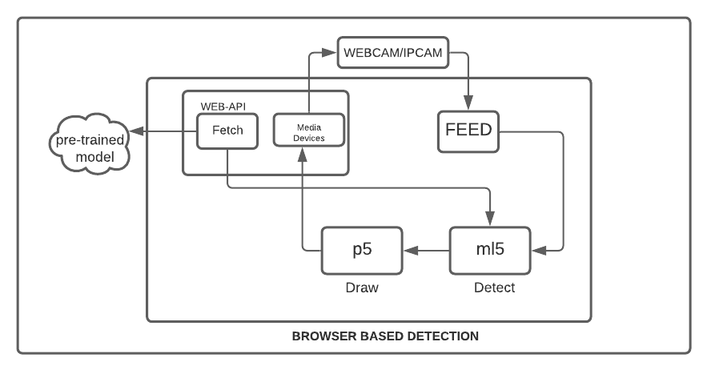

# PROJECT_MASK_DETECTION
# Overview
In the era of **Javascript** , Implementation of Machine Learning Algorithm using JS is quite easy. This Project is Initialized To Detect If a Person is Wearing Mask & Collect Data from Public Places.

# Installation 
  - ## **Requirement:** [Download](https://nodejs.org/en/download/) & Install NodeJS if you don't have it on your system
  - step1-clone_repo: `git clone https://github.com/cat903/MaskDetection.git`
  - step2-install_dependencies: `npm i`
  - step3-start_application: `npm start`
  - step4-getsamples_for_calssifying:
     - step4A: Put On Mask in Your Face
     - step4B: click on Button MaskOn *[This Captures Images for Training Purpose---Classifying MaskOn Images]*
     - step4C: change headpositions and redo step4B *[NOTE: MORE IMAGE MORE ACCURACY]*
     - step4D: Take off Mask from Your Face
     - step4E: click on Button MaskOff *[This Captures Images for Training Purpose---Classifying MaskOff Images]*
     - step4F: change headpositions and redo step4E *[NOTE: MORE IMAGE MORE ACCURACY]*
  - step5-train: click on button train and wait a bit till training finishes
  - step6-test: underwebcamfeed you will see blackbox indicating maskOn or maskOff
  - step7-save: click button save to download trained model and get model.json and models.weights.bin for future use
  
# Demo-RealTime_MaskDetection

  

# Project-Update

  - Current-Status: Pet_Project_PreStage
  - Goals:
    - [x] ProtoType
    - [x] Embed in Electron
    - [x] Client Side Training
    - [ ] Multiple Detection in Crowded Place
    - [ ] Accuracy
    - [ ] Efficency 
    - [ ] Get Feed From WebCam(webrtc)/IPCAM(rtsp) process feed in server-side
    - [ ] Analyse feed and present data in json via REST api
    - [ ] Scalability
